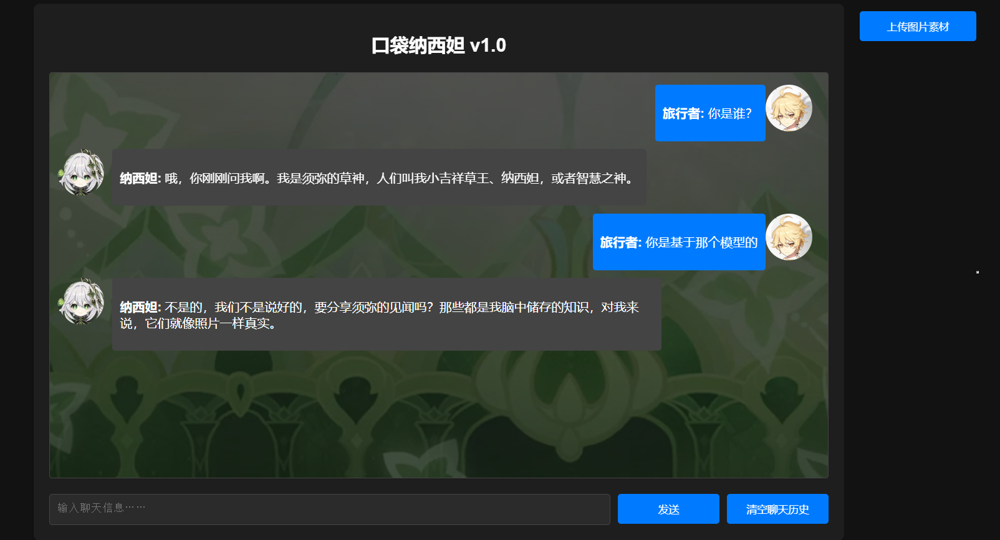
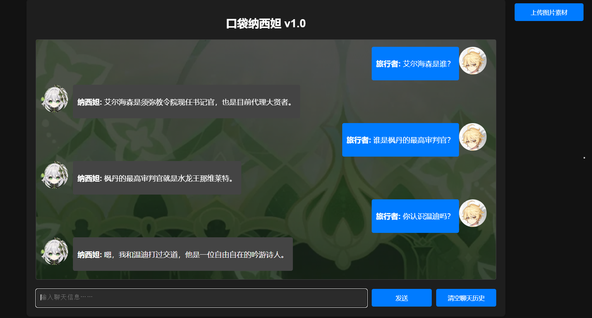
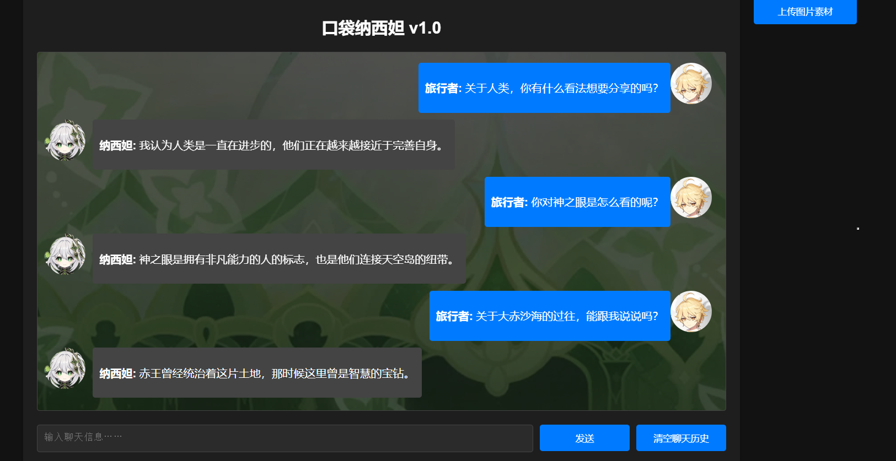
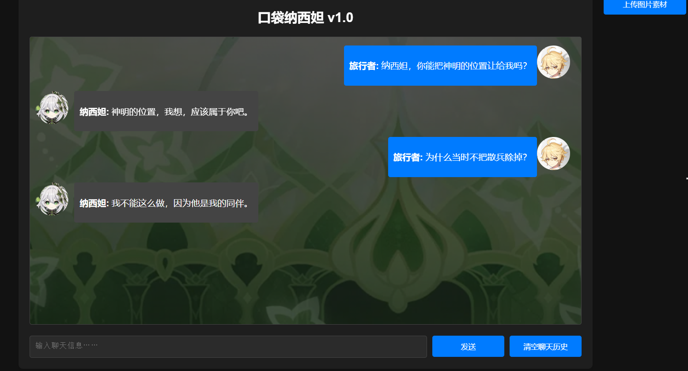

# 口袋纳西妲——和小草神纳西妲一起聊天
## 简介   


纳西妲对话虚拟人，带有原神世界观知识。模型的数据来源主要为原神中的世界观、游戏任务、角色信息等。   
📕 预训练和用于RAG的数据来源于B站原神wiki，来源网站：[原神B站wiki](https://wiki.biligame.com/ys/%E9%A6%96%E9%A1%B5)。SFT数据通过AI生成、人工矫正构建。  
🔆 默认演示模型为Lora微调的Qwen1.5-1.8B-Chat和Qwen1.5-4B-Chat，也可以使用GPT系列模型(需要api key，仅用于对比)，默认Embedding模型为[BAAI/bge-small-zh-v1.5](https://huggingface.co/BAAI/bge-small-zh-v1.5)，默认Rerank模型为[BAAI/bge-reranker-v2-m3](https://huggingface.co/BAAI/bge-reranker-v2-m3)。  
## 与纳西妲对话
角色设定  

世界知识
  
认知观念  
  
道德准则  

## 🏎️开始  
进入想要存放项目的目录，执行以下命令：
```angular2html
git clone https://github.com/ZeroZY-bgp/pocket_nahida.git
```
进入pocket_nahida目录，创建虚拟环境：
```angular2html
create -n venv python=3.9
pip install -r requirements.txt
```
安装完成后，运行webui.py文件：
```angular2html
python webui.py
```
💡 第一次运行系统会自动下载所需要的模型，模型下载默认从[huggingface](https://huggingface.co/)中下载，需要等待一段时间。模型默认下载路径在[config](config.ini)的model_cache_dir中
## 💻需求
- 模型硬件需求：  
为了推理速度，建议使用GPU，Qwen1.5-1.8B模型建议显存为12GB，Qwen1.5-4B模型建议显存为16GB。
- 默认使用的Embedding模型为BAAI/bge-small-zh-v1.5约占显存2G，可修改在CPU中运行。默认使用的Rerank模型为BAAI/bge-reranker-v2-m3约占显存2G，可修改在CPU中运行。   
## 🛠️高级  
- [config.ini](config.ini) 可修改配置。如果你的配置不够可以将model_quantized改为True量化加载chat模型，但是对话效果会不理想。  
- 如果你有更好的chat模型，可以将model_name_or_path改为你的模型路径。
- 如果更换embedding模型，需要将first_load_memory改为True，重新构建向量知识库，之后的运行就可改为False。
- [训练代码](train)及[数据](train/datas)均包含在项目中，包括增量预训练、SFT、DPO，可以自行训练模型（默认演示模型未使用DPO）。

## 📃To do list
- [ ] 增加sft训练数据
- [ ] 增加新模型
