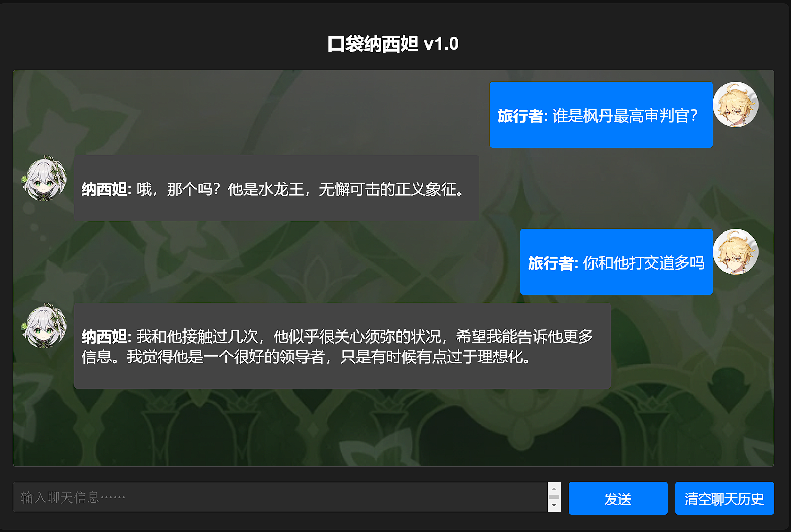

# 口袋纳西妲——和小草神纳西妲一起聊天
## 简介   


🌱 带有原神世界观知识的纳西妲对话虚拟人。   
📕 预训练和用于RAG的数据来源于[B站原神wiki](https://wiki.biligame.com/ys/%E9%A6%96%E9%A1%B5)，主要包含角色信息、世界知识、剧情对话等。SFT数据通过AI生成、人工矫正构建。  
🔆 默认演示模型为Lora微调的Qwen1.5-1.8B-Chat和Qwen1.5-4B-Chat，也可以使用GPT系列模型(需要api key，仅用于对比)。默认Embedding模型为[BAAI/bge-small-zh-v1.5](https://huggingface.co/BAAI/bge-small-zh-v1.5)，默认Rerank模型为[BAAI/bge-reranker-v2-m3](https://huggingface.co/BAAI/bge-reranker-v2-m3)。  
## 与纳西妲对话
角色设定  

世界知识
  
  
认知观念  
  
  


## 🏎️开始  
进入想要存放项目的目录，执行以下命令：
```angular2html
git clone https://github.com/ZeroZY-bgp/pocket_nahida.git
```
进入pocket_nahida目录，创建环境（建议使用conda环境）：
```angular2html
cd pocket_nahida
conda create --name pocket_nahida python=3.9
conda activate pocket_nahida
pip install -r requirements.txt
```
安装完成后，运行webui.py文件：
```angular2html
python3 webui.py
```
💡 第一次运行系统会自动从huggingface上下载所需的模型，需要等待一段时间。模型默认下载路径在c盘，可通过修改[config.ini](config.ini) 文件的model_cache_dir改变模型存放路径。
## 💻需求
- 模型硬件需求：  
为了推理速度，建议使用GPU，Qwen1.5-1.8B模型建议显存为12GB以上，Qwen1.5-4B模型建议显存为16GB以上。
## 🛠️高级  
- [config.ini](config.ini) 可修改配置。
- 可选模型：
  - 仅PT（也能用于对话）
    - ZeroZYbgp/pocket_nahida-4b-lora
    - ZeroZYbgp/pocket_nahida-1.8b-lora
  - PT+SFT
    - ZeroZYbgp/pocket_nahida-4b-lora2
    - ZeroZYbgp/pocket_nahida-1.8b-lora2
- 如果显存不够可以将model_quantized设置为True量化加载模型，但对话效果会不理想。也可以缩小窗口大小dialog_window以节省显存。
- 如果你有自己的模型，可以将model_name_or_path改为你的模型路径（目前仅支持qwen1.5系列模型）。
- 如果更换embedding模型，需要将first_load_memory改为True，重新构建向量知识库，之后的运行就可改为False。
- [训练代码](train)及[数据](train/datas)均包含在项目中，包括增量预训练、SFT、DPO，可以自行训练模型（默认演示模型未使用DPO）。

## 📃To do list
- [ ] 增加sft训练数据
- [ ] 增加新模型
